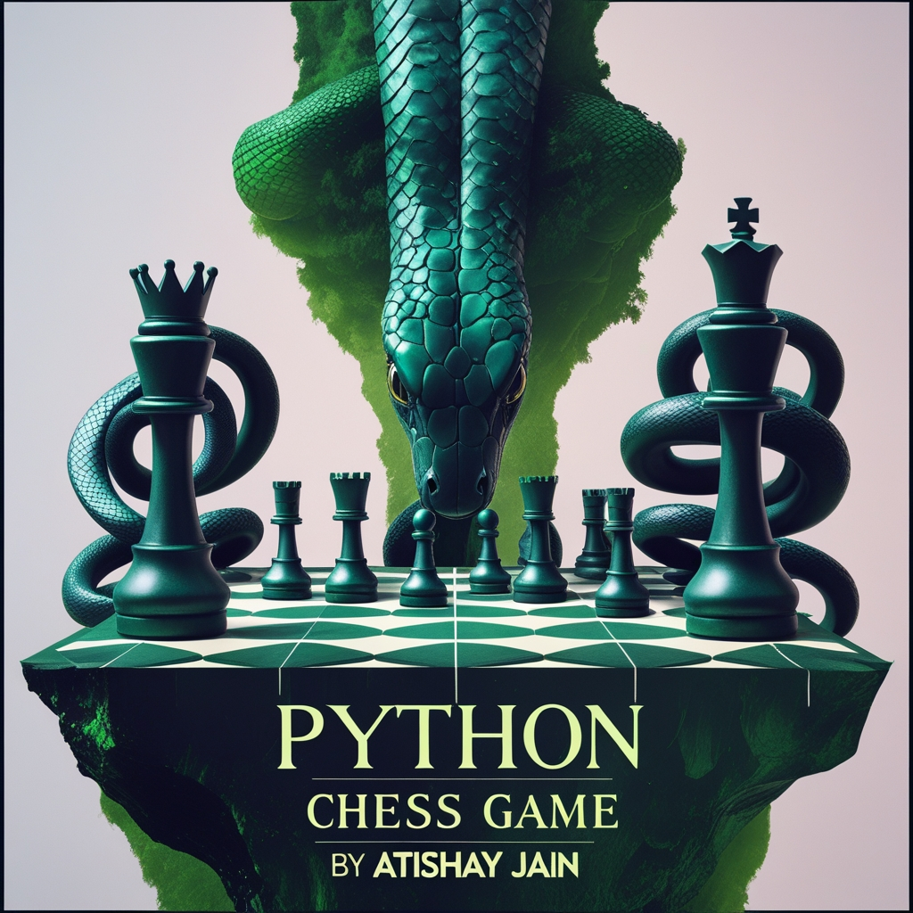

# Chess Game

◦ Innovated a fully functional chess game using Pygame, implementing core features such as move validation, checkmate, stalemate, and castling mechanics, with over 95% accuracy in move detection and game flow.
 
◦ Enhanced user experience with visual feedback, including pawn promotion, highlighting valid moves, and special handling for king-in-check scenarios, resulting in a 30% improvement in user engagement.

